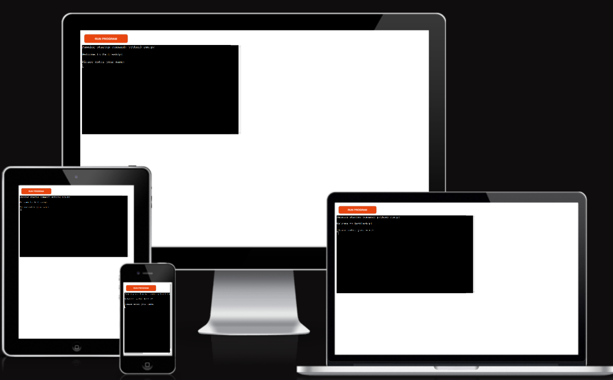
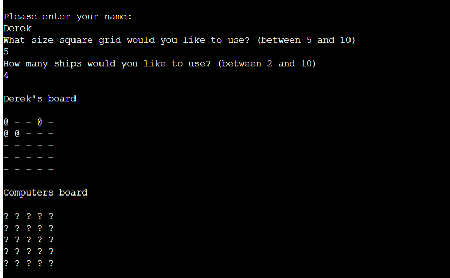
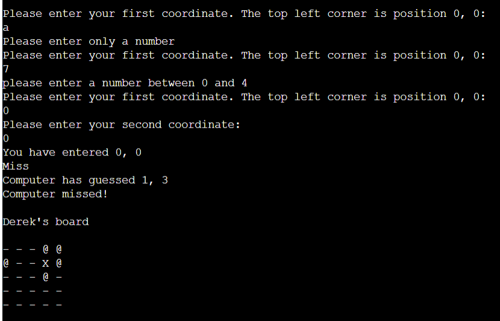

# Battleship 2022
Battleship 2022 is a take on the traditional boardgame battleship. It is a console game made using python and ran using the Code Institute terminal on Heroku.\
<a href="https://battleship2022.herokuapp.com/"> Link to the deployed game</a>

## Getting started
Players are asked to enter their names, size of the board and number of ships they would like to use\
Boards are then randomly generated\
Players can see their ships marked by an "@" \
Players can only see "?" on the computers board \
Players and computers then take turns to guess where the opponents ships are \
Hits are marked with an "*" and missed with a "X"\
The winner is the first to hit and sink all the opponents ships
## Features
### Custom Board Generation
- Players can enter their name
- Players can decide how big a board to use
- Players can decide how many ships to use
- A board is then generated with randomly allocated ships

- Players can then enter their guess
  - Coordinates are then error checked 
  - Only numbers can be entered
  - Only coordinates on the board can be entered
  - The same coordinates cannot be guessed twice

- The game tells the player if they have hit or miss
- The game then shows the randomly gernerated computer guess and tells if it has been a hit or miss
- The computer guess goes through the same checking as the player guess
- The game then checks for a winner after each guess
- After there has been a winner the player can decide to play again if they wish
## Features not implemented
- Different size ships depending on how many ships and how big a board are selected
- A coin toss before the game starts to see who goes first